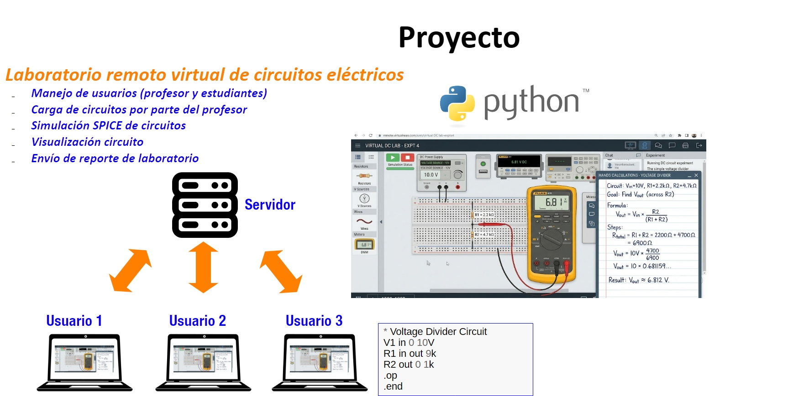

<h1 align="center">
Entrega 1 Proyecto: Servidor de Usuarios y Laboratorios (RA 1, RA 3) <br />
 </h1>
 <p align="center">
Alexander López-Parrado, PhD. <br />
Programación, II-2026 <br />
GDSPROC <br />
Uniquindío <br />
</p>

Con esta práctica se iniciará el desarrollo del código fuente en Python del proyecto del espacio académico. En este caso, y de acuerdo a la arquitectura mostrada en la siguiente figura, se construirá el código del lado del servidor para la gestión de usuarios y prácticas de laboratorio.

<p align="center">

</p>

En ese sentido, la primera entrega del proyecto contempla la creación y prueba de funciones que hacen uso de archivos para la gestión de los usuarios y las prácticas de laboratorio, así como las demás estructuras de programación y tipos de datos estudiados hasta el momento. 

## Código base suministrado

Se suministra el código base del servidor en el archivo [virtuallab_server.py](server/virtuallab_server.py) el cual contiene toda la funcionalidad para que éste opere dentro de una red de área local o en el mismo equipo de prueba. **Este archivo no debe ser modificado bajo ninguna circunstancia**.

En ese sentido, el archivo [virtuallab_server.py](server/virtuallab_server.py) usa el archivo [virtuallab_functions.py](server/virtuallab_functions.py) que incluye definiciones de funciones las cuales deben ser implementadas de acuerdo a los descrito en los comentarios del archivo. **La implementación de estas funciones y su correcto funcionamiento determina la evaluación del lado del servidor del proyecto**.

El servidor debe permitir registrar usuarios con un nombre, número de identificación y contraseña, donde cada usuario podrá tener el rol de estudiante o profesor. Además, todos los usuarios sin importar su rol podrán iniciar y cerrar sesión.

De otro lado, dependiendo del rol del usuario, se permitirán ciertas acciones. Para el caso de los profesores se permitirán las siguientes acciones:

* Obtener la lista de los estudiantes registrados
* Cargar una práctica de laboratorio (archivo zip)
* Obtener la lista de prácticas de laboratorio cargadas por los profesores
* Asignar una práctica de laboratorio a un estudiante
* Obtener la lista de prácticas de laboratorio asignadas por el profesor

Para el caso de los estudiantes se permitirán las siguientes acciones:

* Obtener la lista de las prácticas de laboratorio asignadas
* Descargar una práctica de laboratorio (archivo zip)

Para lograr la funcionalidad anterior, se debe hacer uso de archivos de texto plano, por lo que no se admite usar motores para gestión de bases de datos. 

Adicionalmente, el archivo zip usado para cada práctica de laboratorio debe incluir: lista de conexiones SPICE del circuito, archivo con los nombres de los nodos del circuito. Para la segunda entrega del proyecto se deberá incluir una imagen con un diagrama esquemático del circuito.

Por otra parte, se suministran los archivos [virtuallab_client.py](client/virtuallab_client.py) y [test_virtuallab_client.py](client/test_virtuallab_client.py). En este caso,  [virtuallab_client.py](client/virtuallab_client.py) implementa la funcionalidad básica de los clientes para la conexión con el servidor por lo que **no debe ser modificado bajo ninguna circunstancia**. También, se suministra el script de prueba [test_virtuallab_client.py](client/test_virtuallab_client.py) para verificar el correcto funcionamiento del servidor,  este script puede ser modificado a gusto de los miembros del equipo. Para que [virtuallab_client.py](client/virtuallab_client.py) pueda funcionar correctamente se debe instalar el módulo de Python requests ejecutando el siguiente comando en una terminal:

``` pip install requests```

## ¿Cómo realizar las pruebas?

Para la realización de las pruebas debe ejecutar primero el programa [virtuallab_server.py](server/virtuallab_server.py), la recomendación es verificar el correcto funcionamiento de las funciones, una a la vez. Posteriormente se puede ejecutar el programa [test_virtuallab_client.py](client/test_virtuallab_client.py), en caso de que se creen ventanas emergentes de Windows solicitando permisos, por favor otorgarlos ya que los programas hacen uso de los servicios de red. 

Tenga en cuenta que es posible que [virtuallab_server.py](server/virtuallab_server.py) y [test_virtuallab_client.py](client/test_virtuallab_client.py) se ejecuten en computadores diferentes siempre y cuando los equipos se encuentren conectados a la misma red LAN cableada o inalámbrica. En ese caso basta con consultar la dirección IP del computador que está ejecutando [virtuallab_server.py](server/virtuallab_server.py) mediante el comando ipconfig como se muestra en la siguiente figura.


<p align="center">

</p>

La IP encontrada debe sustituir "localhost" en la línea 6 de [test_virtuallab_client.py]([https://github.com/parrado/lab2/blob/c80a0f73b9324b082ebea63a3377358d36a4c8d8/test_trivia_client.py#L6](https://github.com/parrado/entrega1-proyecto-2-2026/blob/b6be68a135d8f4b58fe7a5d219becb219f730369/client/test_virtuallab_client.py#L6))

# Entrega del laboratorio

El laboratorio debe ser presentado mediante:

1. Repositorio en GitHub.
2. Sustentación individual.

El informe de laboratorio y el enlace al repositorio de GitHub deben ser compartidos en el enlace dispuesto para tal fin en la plataforma Google Classroom.
